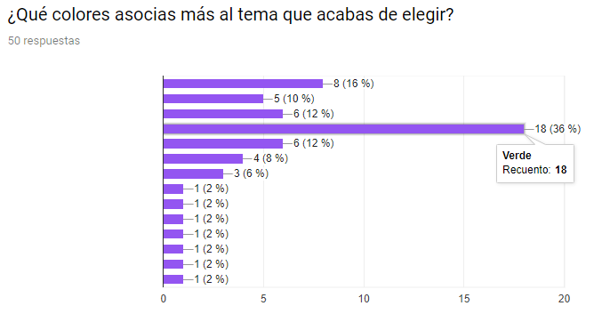
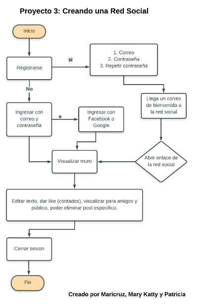
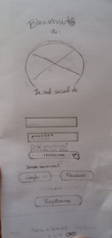
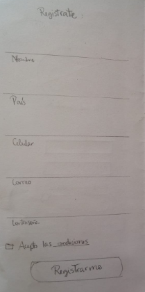
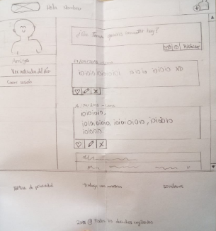
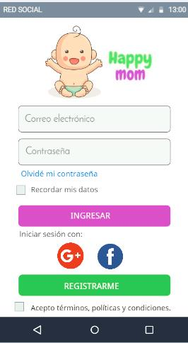
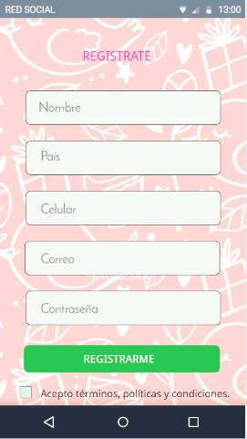

# Creando una Red Social

## Integrantes

* Maricruz Enrique Rivera
* Mary Katty Vicuña Ore
* Patricia Vidal Ramirez

## Preámbulo

Instagram, Snapchat, Twitter, Facebook, Twitch, Linkedin, etc. Las redes
sociales han invadido nuestras vidas. Las amamos u odiamos, y muchxs no podemos
vivir sin ellas.

Hay redes sociales de todo tipo y para todo tipo de intereses. Por ejemplo,
en una ronda de financiamiento con inversionistas, se presentó una red social
para químicos en la que los usuarios podían publicar artículos sobre sus
investigaciones, comentar en los artículos de sus colegas, y filtrar artículos
de acuerdo a determinadas etiquetas o su popularidad, lo más reciente, o lo
más comentado.

## Introducción

Este proyecto se enfoca crear una red social, para lo cual usaremos 
herramientas como: Google Forms (para realizar las encuestas), entrevistas online, sketch
(diseños a lapiz y papel), Balsamiq (para la creación del prototipo de media fidelidad), Figma (para el diseño del prototipo en alta fidelidad tanto para mobiles, tablets como para la web), además de realizar un feedback con el usuario final para saber sobre su experiencia con la app creada.

Posterior al diseño definido, usaremos
**HTML** (un lenguaje de marcado, nos servirá para construir la estructura de la red social),
Bootstrap (framework que nos será de gran ayuda para darle estilos a nuestro proyecto), 
y también usaremos **JavaScript** (este lenguaje de programación nos servirá para darle funcionalidad). Finalmente usaremos **CSS** para darle un formato orientado a las necesidades de los usuarios, asi como el color adecuado respecto a los resultados de la investigación de mercado.

## Sprint 1

Tomando como punto de partida los requerimientos del cliente, realizamos el Sprint Planning 
de la semana, con sus respectivas épicas, tal como se muestra en la siguiente imagen.

### Encuesta 

Realizamos una encuesta a 50 personas de nuestro entorno y a la vez algunos que eran del 
entorno de ellos, obtuvimos los siguientes resultados:

[Encuesta](https://goo.gl/forms/qDz2VB1k2nCl5zp12)

  
  
  
  
  
  
  
  
  

***

### Resultados en base a la encuesta

* Tomando en cuenta las elecciones de los usuarios, el tema de la red social será sobre EDUCACIÓN 
  
### Diagrama de flujo del proyecto
  
*  Se realizó un diagrama de flujo enfocándonos en los pasos que seguiría una persona que está 
   interesada en usar la red social.

   

### Sketch

  ***

## Checklist

### General

* [ ] Producto final sigue los lineamientos del diseño.

### `README.md`

*  Definición del producto: 
El nombre de la red social que creamos es _____________.   Esta red social es para tratar temas de Educación.
    
    
  +  Cuáles son los elementos básicos que tiene una red social. 
      + Poder publicar un post.
      + Poder poner like a una publicación.
      + Llevar un conteo de los likes.
      + Poder eliminar un post específico.
      + Poder publicar y mostrar los posts que son sólo para mi (o amigos - ver Hacker edition 😉) y para todo público.
      + Pedir confirmación antes de eliminar un post.
      + Al darle click en el botón editar, debe cambiar el texto por un input que permita editar el texto y cambiar el link por guardar.
      + Al darle guardar debe cambiar de vuelta a un texto normal pero con la información editada.
      + Al recargar la página debo de poder ver los textos editados

*  Quiénes son los principales usuarios de producto. 
El producto está dirigido tanto a estudiantes como para profesores, para que en ambos casos puedan compartir conocimientos y contribuir con información respecto a ese tema.

*  Cómo descubriste las necesidades de los usuarios. 
Logramos observar que el público al que va dirigido compartía en sus redes (principalmente en facebook o via mail) temas relacionados con la educación, pero ya que en el facebook los temas son variados quedaba de lado los artículos de un mismo interés y no había más oportunidad de enfocarse en temas de este rubro.

*  Qué problema resuelve el producto para estos usuarios. 
El problema era que en una red social común se perdía información en el muro con respecto a temas relacionados a la Educación, así que lo que resuelve esta nueva red social es tener un espacio con este tema en común que es muy amplio para analizar, expresar, explayarse, compartir artículos, crear redes entre los contactos, opiniones, debates, tesis, avisar sobre eventos, conferencias en distintos lugares a nivel nacional e internacional.

*  Cuáles son los objetivos de estos usuarios en relación con el producto. 
Comunicar temas relacionados a la Educación, poder implementar niveles de educación más avanzados por ejemplo como en Finlandia, ya que su sistema está centrado en que el alumno aprenda de manera autónoma, además de cuidar sus emociones, ya que por medio de las emociones también ganas conocimiento.

*  Cuáles son las principales funcionalidades del producto y cuál es su prioridad. 
Habían temas que no llegaban a todos por igual en las redes conocidas a todos los interesados en un mismo momento, y tener una red social con un tema específico hizo el ambiente sea más rico, que puedan compartir sus conocimientos alumnos y profesores para que ambos aprendan mutuamente de otros conceptos educativos y priorizar buscando mejores soluciones para reducir las tasas de analfabetismo.

*  Cómo verificaste que el producto les está resolviendo sus problemas. 

*  Cómo te aseguramos que estos usuarios usen este producto. 
Compartimos la red social creada con estudiantes para tener un feedback sobre la app y les pareció coherente poder separar un tema que pueden enfocarse para asi contribuir con la sociedad.

*  Benchmark de las principales redes sociales. 
Previamente a realizar la encuesta y elegir un tema buscamos información sobre el uso de las redes sociales en Perú y este es el resultado:
Una de nuestras conclusiones es que la gente está más acostumbrada a la distribución del diseño de la red social facebook, asi que vamos a tomarla en cuenta para el diseño y funcionalidad.

Además encontramos información sobre el porcentaje de las actividades más frecuentes que realizan los usuarios al ingresar en una red social.

*  Resumen de entrevistas con usuarios.
*  Link/screenshots del prototipo de alta fidelidad.

*  Conclusiones de testing con el prototipo de alta fidelidad con usuarios.
*  Conclusiones de testing con el producto en HTML.

### Pruebas / tests

*  Tests unitarios cubren un mínimo del 70% de statements, functions, lines y branches.
*  Pasa tests (y linters) (`npm test`).

### Creación de cuenta (sign up)

* [ ] Permite crear cuenta.
* [ ] Valida email.
* [ ] Valida password.
* [ ] Muestra mensajes de error.

### Inicio de sesión (sign in)

* [ ] Permite iniciar sesión.
* [ ] Valida email.
* [ ] Valida password.
* [ ] Muestra mensajes de error.

### Muro (wall/feed)

* [ ] Muestra _muro_.
* [ ] Permite publicar nuevos posts.
* [ ] Permite eliminar posts.
* [ ] Pide confirmación antes de borrar posts.
* [ ] Permite editar posts (in place).
* [ ] Permite publicar y filtrar posts por público/yo.
* [ ] Permite dar _like_ a los posts y llevar un conteo de ellos.

**¡Gracias por leer hasta el final!**
