# Creando Happy Babies (Red Social)

## Integrantes

   * Maricruz J Enrique Rivera
   * Mary Katty Vicuña Ore
   * Patricia Vidal Ramirez

## Preámbulo

Instagram, Snapchat, Twitter, Facebook, Twitch, Linkedin, etc. Las redes sociales han invadido
nuestras vidas. Las amamos u odiamos, y muchxs no podemos vivir sin ellas.

Hay redes sociales de todo tipo y para todo tipo de intereses. Por ejemplo,
en una ronda de financiamiento con inversionistas, se presentó una red social
para químicos en la que los usuarios podían publicar artículos sobre sus
investigaciones, comentar en los artículos de sus colegas, y filtrar artículos
de acuerdo a determinadas etiquetas o su popularidad, lo más reciente, o lo
 más comentado.

## Introducción

Este proyecto se enfoca crear una red social, para lo cual usaremos
herramientas como: **Google** Forms (para realizar las encuestas), entrevistas online, sketch
(diseños a lápiz y papel), **Illustrator** (para el diseño del prototipo en alta fidelidad: para móbiles, tablets y web), además de realizar un feedback con el usuario final para saber sobre su experiencia con la app creada.

Posterior al diseño definido, usaremos **HTML** (un lenguaje de marcado, nos servirá para construir la estructura de la red social), además de **JavaScript** (este lenguaje de programación nos servirá para darle funcionalidad). Finalmente usaremos **CSS** para darle un formato orientado a las necesidades de los usuarios, así como el color adecuado respecto a los resultados de la investigación de mercado.

## Sprints

Tomando como punto de partida los requerimientos del cliente, realizamos el Sprint Planning de la semana, con sus respectivas épicas, tal como se muestra en la siguiente imagen.

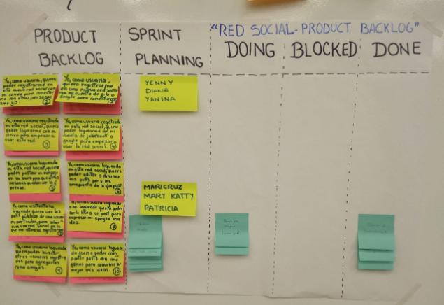

Además usamos Trello para especificar las actividades durante los sprints 
    Link para ver el [Trello](https://trello.com/b/7DNWOgiS/red-social) 

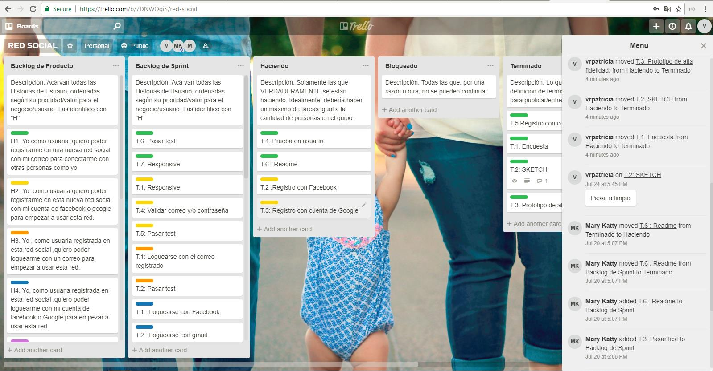

### Encuesta

Realizamos una encuesta a 50 personas de nuestro entorno y a la vez algunos que eran del 
entorno de ellos, obtuvimos los siguientes resultados: Aquí link de encuesta realizada [Encuesta](https://goo.gl/forms/qDz2VB1k2nCl5zp12)

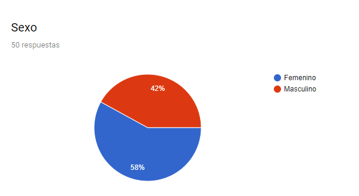
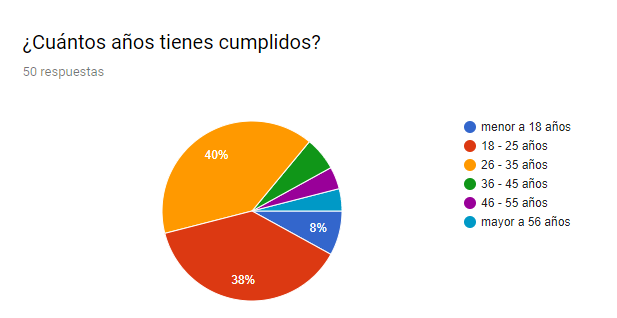
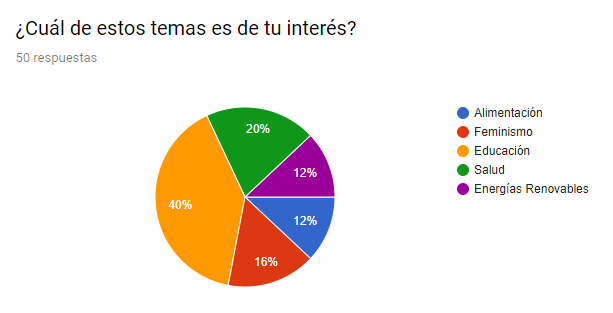
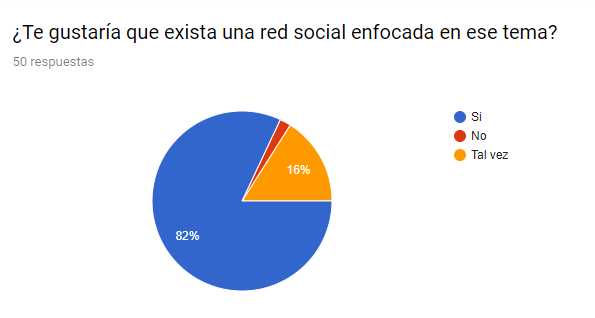
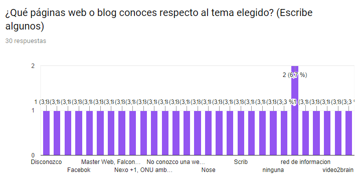
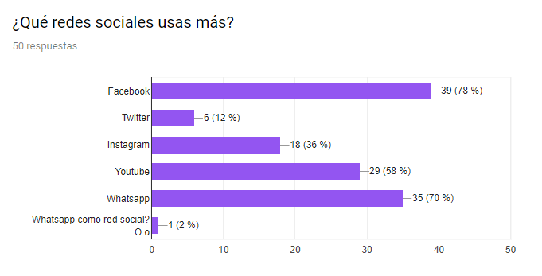
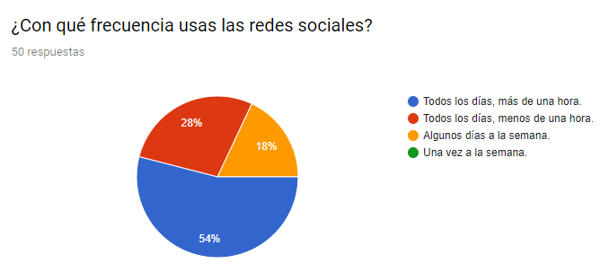
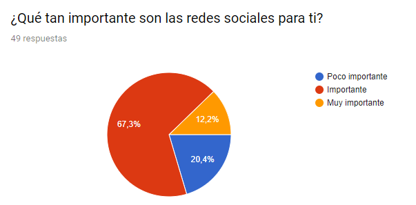

***

### Resultados en base a la encuesta

* Tomando en cuenta las elecciones de los usuarios, la red social será EDUCACIÓN, a partir de aquí nos enfocaremos en un tema específico, en este caso elegimos educación para madres y padres primerizos, tomando en cuenta desde la etapa del embarazo hasta los 5 años de la criatura.

### Entrevista

Realizamos entrevista a cinco usuarios de nuestro entorno.

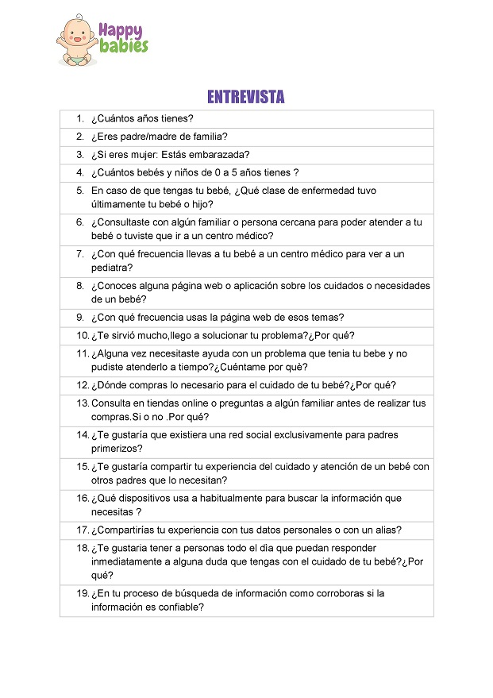

### Diagrama de flujo del proyecto

 * Se realizó un diagrama de flujo enfocándonos en los pasos que seguiría la persona que está interesada en usar la red social.

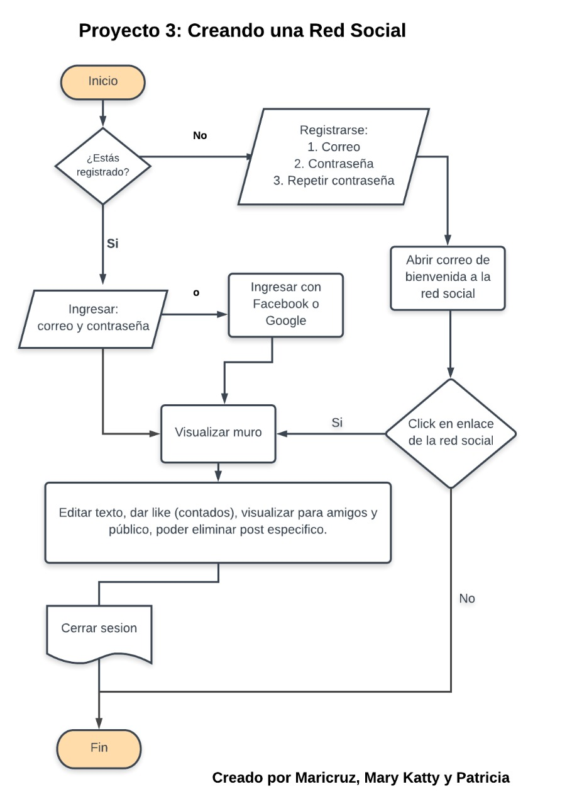

### Sketch de baja fidelidad

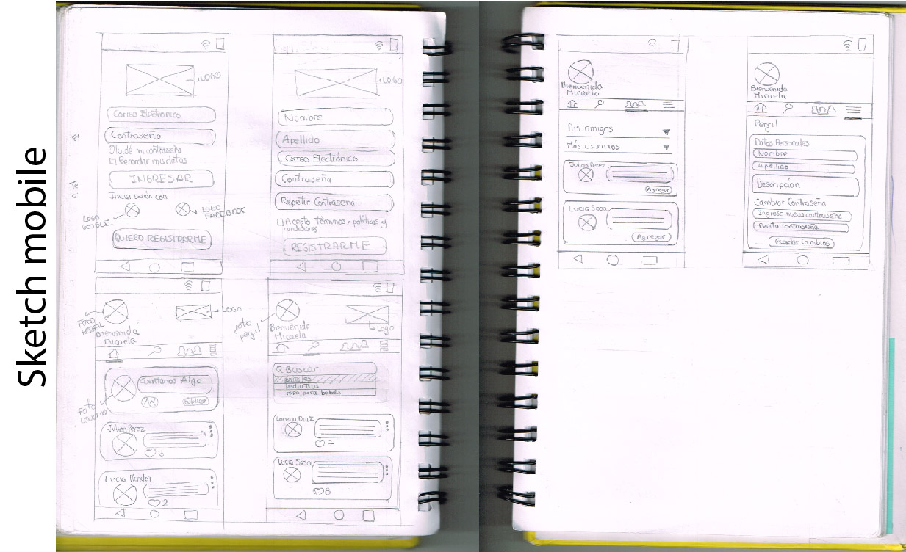

### Creación de logo:

**Opciones de logo:**
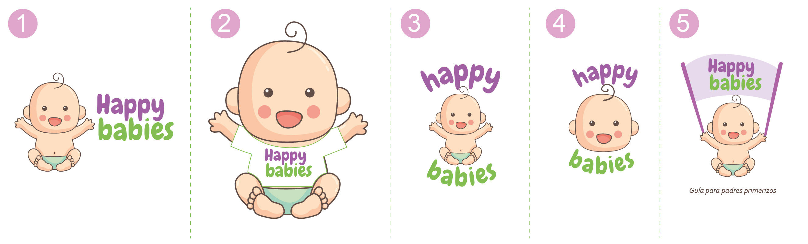
**Logo Final:**
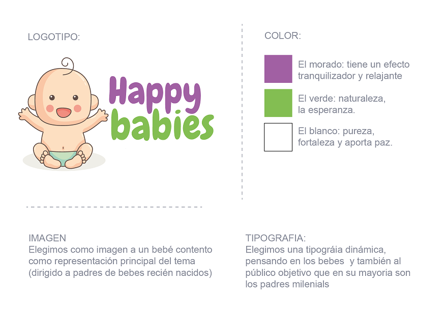

### Prototipo de alta fidelidad

**Version celular** 
  
**Version web** 

## Checklist

### General

 * [ ] Producto final sigue los lineamientos del diseño.

### README.md

*  **Definición del producto:** 
    El nombre de la red social que creamos es **Happy babies**.   Esta red social es para tratar temas relacionados a las etapas del crecimiento del bebé (desde el inicio del embarazo a los 5 años), en la que madres o padres aportan testimonios, datos, tips, talleres. Un espacio para que todos ellos puedan crecer juntos.
  
  
 +  **Cuáles son los elementos básicos que tiene una red social.** 
     + Poder publicar un post.
     + Poder poner like a una publicación.
     + Llevar un conteo de los likes.
     + Poder eliminar un post específico.
     + Poder publicar y mostrar los posts que son sólo para mi (o amigos - ver Hacker edition 😉) y para todo público.
     + Pedir confirmación antes de eliminar un post.
     + Al darle click en el botón editar, debe cambiar el texto por un input que permita editar el texto y cambiar el link por guardar.
     + Al darle guardar debe cambiar de vuelta a un texto normal pero con la información editada.
     + Al recargar la página debo de poder ver los textos editados

*  **Quiénes son los principales usuarios de producto.** 

     + El producto está dirigido a madres o padres millennials (nacidos entre 1983 - 2000), que de por sí ya tienen una facilidad con el uso de la tecnología, tomándolo en cuenta para que puedan compartir conocimientos y contribuir con información útil para cuidados del bebé.

*  **Cómo descubriste las necesidades de los usuarios.** 

      + Logramos observar que el público al que va dirigido compartía en sus redes (principalmente en facebook o via mail) temas relacionados con el nacimiento de su bebé, pero ya que en el facebook los temas son variados quedaba de lado los artículos de un mismo interés y no había más oportunidad de enfocarse en temas de este rubro. Entonces acudían a consejos de sus pediatras, parientes o amistades que por inexperiencia sabían poco o nada sobre este tema tan importante.

*  **Qué problema resuelve el producto para estos usuarios.** 

    + El problema era que en una red social común se perdía información en el muro con respecto a temas relacionados a la crianza del bebé, así que lo que resuelve **Happy babies** es tener un espacio con este tema en común que es muy amplio para analizar, expresar, explayarse, compartir artículos, talleres, eventos, crear redes entre los contactos, opiniones, experiencias, conferencias en distintos lugares a nivel nacional e internacional.

    + El problema era que en una red social común se perdía información en el muro con respecto a temas relacionados a la crianza del bebé, así que lo que resuelve esta nueva red social es tener un espacio con este tema en común que es muy amplio para analizar, expresar, explayarse, compartir artículos, talleres, eventos, crear redes entre los contactos, opiniones, experiencias, conferencias en distintos lugares a nivel nacional e internacional.

*  **Cuáles son los objetivos de estos usuarios en relación con el producto.** 

     + Comunicar temas relacionados a la crianza del bebé, recordarles a los demás usuarios que no están solos en esta nueva etapa de sus vidas, mantener la calma, además de cuidar sus emociones ya que a la larga son los comportamientos que también aprenderá el bebé durante sus 5 primeros años que marcarán su vida.

*  **Cuáles son las principales funcionalidades del producto y cuál es su prioridad.** 

    + Tener una red social con un tema específico que puedan compartir sus conocimientos para que aprendan mutuamente de otros conceptos de manera inmediata solo con conectarse a la app **Happy babies**. La prioridad es darle a los padres información destacada sobre paternidad.

*  **Cómo verificaste que el producto les está resolviendo sus problemas.** 

    + Verificamos testeando en usuarios reales, para tener un feedback sobre la app y les pareció coherente poder separar un tema que pueden enfocarse para así contribuir con la sociedad.

* **Cómo te asegurarás que estos usuarios usen este producto.** 
    + Los usarían ya que el producto final cubre una necesidad a un determinado público que no precisamente son minoría.

*  **Benchmark de las principales redes sociales.** 
    + Una de nuestras conclusiones es que la gente está más acostumbrada a la distribución del diseño de la red social facebook, así que vamos a tomarla en cuenta para el diseño y funcionalidad.

*  **Resumen de entrevistas con usuarios.** 
    + En la entrevista realizada, notamos que a los usuarios realmente les es útil tener un contacto directo no solo con personas que esten en la misma etapa si no también con profesionales de la salud, como pediatras quienes podrían instruir mejor sobre el cuidado del bebé, y no solo tomar en cuenta los concejos de familiares y amistades, que a veces pueden influir en no tomar decisiones no muy favorables para el bienestar del bebé.

    Aquí link del audio de la entrevista realizada [Entrevista](https://soundcloud.com/patricia-vidal-136075208/encuesta-audio)

*  **Conclusiones de testing con el prototipo de alta fidelidad con usuarios.** 
    + Notamos que el usuario por lo general tiende a entrar con su cuenta de facebook a una nueva app para evitar estar registrandose ya que lo ven tedioso escribir el correo y contraseña. 

    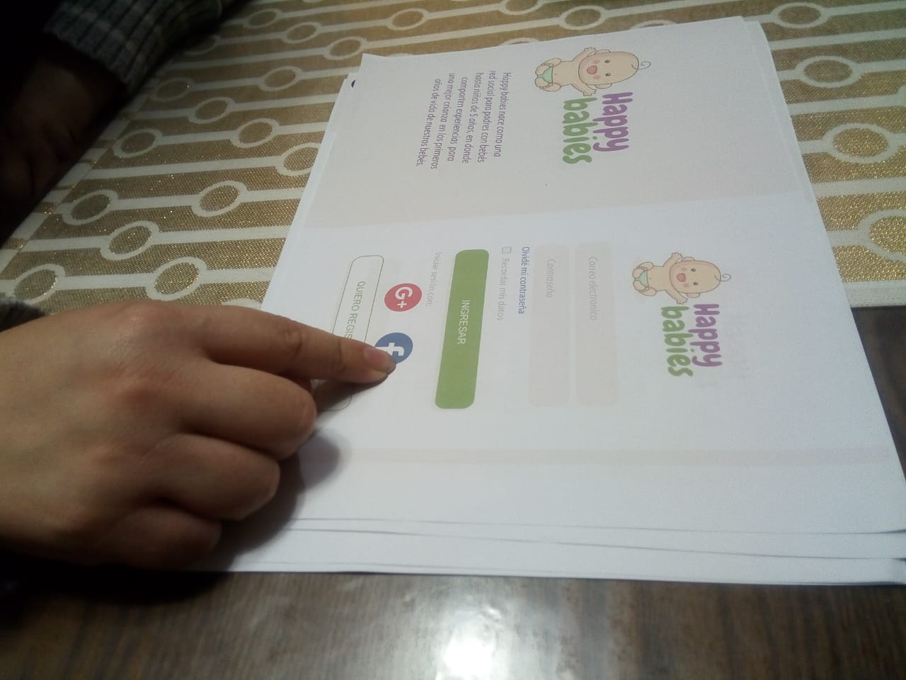 

    Uno de los comentarios que recibimos como feedback fue el de retirar en el index (el momento de ingresar a la app) un logo ya que habian 2 y visualmente dieron a entender que una sola vez bastaba para tomar en cuenta de que se trataba. 

    Aquí link del video del test con el prototipo web al usuario [TestPrototipo](https://youtu.be/xQ4Qgik_mnU)
    

### Presentación en plataformas digitales (celular, tablet y vista web)

  
### Pruebas / tests

*  Tests unitarios cubren un mínimo del 70% de statements, functions, lines y branches.
*  Pasa tests (y linters) (`npm test`).

### Creación de cuenta (sign up)

* [ ] Permite crear cuenta.
* [ ] Valida email.
* [ ] Valida password.
* [ ] Muestra mensajes de error.

### Inicio de sesión (sign in)

* [ ] Permite iniciar sesión.
* [ ] Valida email.
* [ ] Valida password.
* [ ] Muestra mensajes de error.

### Muro (wall/feed)

* [ ] Muestra _muro_.
* [ ] Permite publicar nuevos posts.
* [ ] Permite eliminar posts.
* [ ] Pide confirmación antes de borrar posts.
* [ ] Permite editar posts (in place).
* [ ] Permite publicar y filtrar posts por público/yo.
* [ ] Permite dar _like_ a los posts y llevar un conteo de ellos.

**Gracias por leer hasta el final.**
  